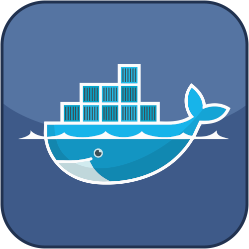

# Docker

## Présentation

Le but de ce plugin est de pouvoir obtenir des informations de vo(s)tre plateforme(s) Docker et de pouvoir effectuer quelques actions sur vos container en cas de besoin.

Le plugin ne contient pas de dépendances.
Le pilotage et l'interrogation du docker et des containers seront effectués via SSH. 

## Prérequis 

Voici ce dont le plugin a besoin : 
* Créer un compte dédié avec un mot de passe assez compliqué (en évitant le caractère & (vous pouvez utiliser un compte existant bien entendu)) sur le système hébergeant votre docker
* Autoriser le compte à faire du SSH sur votre hote hébergeant DOCKER (Synology / Machine Linux)
* Sur un synology, créer un groupe docker (attention à la case), y placer l'utilisateur que vous venez de créer et relancer le package docker sur votre synology via le gestionnaire de package, [Procédure](https://docs.docker.com/install/linux/linux-postinstall/#manage-docker-as-a-non-root-user)
* Sur un linux, autoriser l'utilisateur que vous venez de créer a executer sudo docker sur votre linux en modifiant le sudoers.

## Configuration

### Configuration générale

Il n'y a pas de paramètre particulier au niveau de la configuration du plugin.

### Ajouter un équipement de type DOCKER

* Cliquer sur le bouton Ajouter sur la page du plugin Vmware
* Saisir le nom de votre équipement
* Cliquer sur OK

Sur la page de l'équipement DOCKER il faudra saisir les informations suivantes :

* Adresse IP de l'hôte hébergeant votre DOCKER
* Login  (Vous pouvez créer un compte dédié pour ce besoin en limitant les droits de ce compte si vous le souhaitez comme expliqué en prérequis)
* Mot de passe
* Port SSH (22 sera utilisé si le champ est vide)
* Sauvegarder l'équipement DOCKER

## Informations

Lors de la sauvegarde du DOCKER, le DOCKER n'est pas interrogé directement.

> Il faut utiliser le bouton synchroniser ou la commande Refresh pour lancer l'interrogation du DOCKER et récupérer les informations du DOCKER et des containers. Celà prend quelques secondes selon la quantité de containers déployés.

Chaque container aura les informations suivantes :
* ID du container
* Nom
* Statut du container
* Online
* Santé
* Image source
* Date du dernier démarrage
* uptime (s)
* Docker Parent (pour connaitre le parent d'un container afin de gagner en lisibilité)
* Cpu usage (%)
* Memory usage (%)

Chaque VM aura les commandes suivantes :
* Start
* Restart
* Stop
* Kill

Un DOCKER aura les informations suivantes : 
* Nombre de Containers
* Nombre de Containers allumés
* Nombre de Containers en pauses
* Nombre de Containers éteints
* Nombre d'image disponible
* Version du docker
* Online

## Cron

Le plugin s'appuie sur 1 cron
* cron5 -> met à jour toutes les 5 minutes les informations de vo(s)tre DOCKER(s) et des containers associés

> Cela est désactivable dans la page de configuration du plugin docker

  

## FAQ

> Si l'accès SSH est non fonctionnel, vérifiez que vous avez bien configuré l'accès en utilisant putty par exemple et en entrant une commande de test

> L'accès au menu de gauche (disponible en V3) est possible en cliquant sur l'icone Docker située à gauche du texte : Mes équipements Docker

## Troubleshooting

> Si vous avez un quelconque problème avec le plugin, passer le log en débug et communiquez le sur [Community](https://community.jeedom.com/) en créant un sujet et en taggant le plugin si vous n'avez pas trouvé une réponse existante corrigeant votre problème.

## Changelog

[Voir la page dédiée](../changelog.md).
